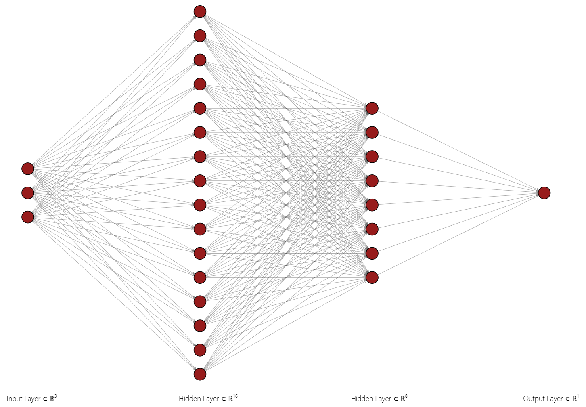
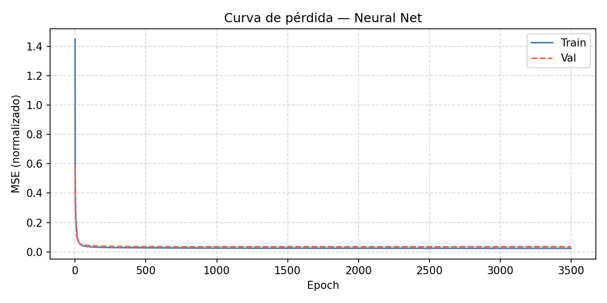
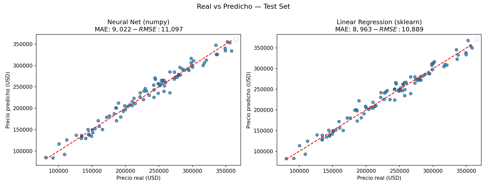

# Neural Network from Scratch with NumPy — vs scikit-learn

A fully-connected neural network implemented in **pure NumPy**: forward pass, backpropagation, and mini-batch gradient descent all derived by hand, with no deep learning framework involved. The model includes features appropriate for a project of this scope — He initialization, leak-free normalization, shuffled mini-batches, and validation monitoring — and is benchmarked directly against scikit-learn's Linear Regression, matching the accuracy of a battle-tested, optimized implementation.

---

## Interactive Demo

The project includes a **Streamlit demo** that lets you tweak hyperparameters in real time and visualize the results:

- Number of hidden layers (1–10)
- Neurons per individual layer (1–36)
- Learning rate and number of epochs
- Automatic comparison against Linear Regression
- Loss curve and predicted vs. actual scatter plots

```bash
streamlit run app.py
```

> **[Open Demo on Streamlit Cloud](https://neuralnetworkv1.streamlit.app/)**

---

## Project Structure

```
├── net.py                          # Neural network implemented from scratch
├── linear_regression_baseline.py   # Baseline using sklearn
├── main.py                         # Main script: data, training, evaluation
├── app.py                          # Interactive Streamlit demo
├── housing.csv                     # Dataset
├── loss_curve.png                  # Train vs. validation loss curve
└── comparacion.png                 # Predicted vs. actual scatter plots (NN vs. LR)
```

---

## Installation and Usage

```bash
# Clone the repository
git clone https://github.com/Juanarena29/NeuralNetworkv1
cd NeuralNetworkv1

# Install dependencies
pip install numpy pandas scikit-learn matplotlib streamlit

# Run
python main.py

# Run interactive demo
streamlit run app.py
```

The script trains both the neural network and the linear regression model, prints metrics to the console, and saves `loss_curve.png` and `comparacion.png` to the current directory.

---

## The Neural Network — `net.py`

### Configurable Architecture

The network is defined by a list of dimensions `layer_dims`, specifying the size of each layer including the input and output. For example, `[3, 16, 8, 1]` produces the following architecture:

```
Input (3) → Hidden (16) → Hidden (8) → Output (1)
```

This allows changing the depth and width of the network without modifying anything else. Hidden layers use **ReLU** as their activation function, and the output layer is **linear** (no activation), which is standard for regression tasks.



---

### Mathematical Reference — Matrix Computations

For a network with two hidden layers and a batch of **N** examples, the tensors have the following shapes:

| Symbol | Description | Shape |
|---|---|---|
| `X` | Input | `(N, 3)` |
| `W1`, `b1` | Weights and bias, layer 1 | `(3, 16)`, `(1, 16)` |
| `W2`, `b2` | Weights and bias, layer 2 | `(16, 8)`, `(1, 8)` |
| `W3`, `b3` | Weights and bias, output layer | `(8, 1)`, `(1, 1)` |
| `Ŷ` | Prediction | `(N, 1)` |

#### Forward Pass

$$Z^{[1]} = X W^{[1]} + b^{[1]} \qquad (N,3)\cdot(3,16) \rightarrow (N,16)$$

$$A^{[1]} = \text{ReLU}(Z^{[1]}) \qquad (N,16)$$

$$Z^{[2]} = A^{[1]} W^{[2]} + b^{[2]} \qquad (N,16)\cdot(16,8) \rightarrow (N,8)$$

$$A^{[2]} = \text{ReLU}(Z^{[2]}) \qquad (N,8)$$

$$Z^{[3]} = A^{[2]} W^{[3]} + b^{[3]} \qquad (N,8)\cdot(8,1) \rightarrow (N,1)$$

$$\hat{Y} = Z^{[3]} \qquad \text{(linear output)}$$

#### Loss

$$\mathcal{L} = \frac{1}{N} \sum_{i=1}^{N} (\hat{y}_i - y_i)^2$$

#### Backward Pass

**Initial gradient** (from the loss back to the last layer):

$$dZ^{[3]} = \frac{2}{N}(\hat{Y} - Y) \qquad (N,1)$$

**Layer 3 → 2:**

$$dW^{[3]} = (A^{[2]})^T \cdot dZ^{[3]} \qquad (8,N)\cdot(N,1) \rightarrow (8,1)$$

$$db^{[3]} = \sum_{\text{batch}} dZ^{[3]} \qquad (1,1)$$

$$dA^{[2]} = dZ^{[3]} \cdot (W^{[3]})^T \qquad (N,1)\cdot(1,8) \rightarrow (N,8)$$

$$dZ^{[2]} = dA^{[2]} \odot \mathbb{1}[Z^{[2]} > 0] \qquad (N,8)$$

**Layer 2 → 1:**

$$dW^{[2]} = (A^{[1]})^T \cdot dZ^{[2]} \qquad (16,N)\cdot(N,8) \rightarrow (16,8)$$

$$db^{[2]} = \sum_{\text{batch}} dZ^{[2]} \qquad (1,8)$$

$$dA^{[1]} = dZ^{[2]} \cdot (W^{[2]})^T \qquad (N,8)\cdot(8,16) \rightarrow (N,16)$$

$$dZ^{[1]} = dA^{[1]} \odot \mathbb{1}[Z^{[1]} > 0] \qquad (N,16)$$

**Layer 1:**

$$dW^{[1]} = X^T \cdot dZ^{[1]} \qquad (3,N)\cdot(N,16) \rightarrow (3,16)$$

$$db^{[1]} = \sum_{\text{batch}} dZ^{[1]} \qquad (1,16)$$

#### Weight Update (SGD)

$$W^{[l]} \leftarrow W^{[l]} - \alpha \cdot dW^{[l]}$$

$$b^{[l]} \leftarrow b^{[l]} - \alpha \cdot db^{[l]}$$

where $\alpha$ is the learning rate. The symbol $\odot$ denotes element-wise (Hadamard) multiplication, and $\mathbb{1}[Z > 0]$ is the derivative of ReLU — a binary mask that equals 1 where the pre-activation was positive and 0 where it was ≤ 0.

---

### Weight Initialization — He Initialization

```python
self.params[f"W{l}"] = np.random.randn(n_in, n_out) * np.sqrt(2 / n_in)
self.params[f"b{l}"] = np.zeros((1, n_out))
```

Weights are initialized using **He initialization** (also known as Kaiming initialization), scaled by `√(2 / n_in)`. This technique is designed specifically for ReLU-activated networks: it prevents vanishing or exploding gradients in the early iterations and is considered the de facto initialization scheme for this type of activation.

Biases are initialized to zero, which is standard practice.

---

### Forward Pass

```python
Z = A @ W + b        # Pre-activation: (N, n_in) @ (n_in, n_out) → (N, n_out)
A = relu(Z)          # Activation (except on the last layer)
```

At each layer `l`, the **pre-activation** `Z` is computed and then ReLU is applied. The final layer returns `Z` directly (linear). All `Z` and `A` values are stored in `self.cache` because the backward pass needs them to compute gradients.

---

### Backward Pass — Backpropagation

This is the heart of training. The gradient of the loss function with respect to every parameter in the network is computed by traversing the layers in reverse order.

**Loss function:** MSE (Mean Squared Error)

$$\mathcal{L} = \frac{1}{N} \sum_{i=1}^{N} (\hat{y}_i - y_i)^2$$

**Initial gradient** (at the linear output, `dA = dZ`):

```python
dZ = (2 / N) * (y_pred - y_true)   # shape: (N, 1)
```

**For each layer (last to first):**

```python
# Gradient of the weights
dW = A_prev.T @ dZ           # (n_in, N) @ (N, n_out) → (n_in, n_out)

# Gradient of the bias — summed over the batch
db = dZ.sum(axis=0, keepdims=True)

# Propagate the gradient to the previous layer
dA_prev = dZ @ W.T                              # (N, n_in)
dZ      = dA_prev * relu_deriv(Z[l-1])          # ReLU mask
```

The bias gradient is summed over the batch axis (`axis=0`) because the bias `b` is **shared** across all examples in the batch during the forward pass: each example contributes independently to the gradient, and those contributions accumulate by summation.

The ReLU derivative acts as a **binary mask**: it lets the gradient pass through where the pre-activation was positive and blocks it where it was ≤ 0.

---

### Mini-Batch Gradient Descent

```python
for start in range(0, N, batch_size):
    X_batch = X_shuffled[start : start + batch_size]
    y_batch = y_shuffled[start : start + batch_size]

    y_pred_batch = self.forward(X_batch)
    self.backward(y_batch)
    self.update()
```

Rather than computing the gradient over the entire dataset (batch gradient descent) or over a single example (pure SGD), **mini-batch gradient descent** is implemented: the dataset is split into blocks of size `batch_size`, and one optimization step is taken per block.

> **Why mini-batches on a small dataset?**
>
> In this specific project, with only a few hundred examples, mini-batches produce no observable advantage over using the full batch. However, they are implemented deliberately to demonstrate how they work, since at larger scale they are **essential**:
>
> - They allow training on datasets that don't fit in RAM/VRAM.
> - They introduce stochastic noise into the gradient, which helps escape local minima.
> - They leverage GPU parallelism far more efficiently than one example at a time.

In addition, the dataset is **randomly shuffled** at the start of each epoch before batches are formed, ensuring the network never sees the same mini-batches in the same order.

---

### Validation Set

During training, the loss is evaluated on a **held-out validation set** at every epoch — a set the network never uses to update its weights:

```python
if X_val is not None:
    y_val_pred = self.forward(X_val)
    val_loss = float(np.mean((y_val_pred - y_val) ** 2))
```

This is used to monitor whether the network is **generalizing** or memorizing the training set (overfitting). If the training loss keeps falling while the validation loss starts rising, that is a clear sign of overfitting.

This project uses a **70% / 15% / 15%** split (train / val / test), where normalization statistics are computed exclusively on the training set and applied to val and test, preventing any data leakage.

---

## Loss Curve



The curve shows that the network converges quickly during the first ~100 epochs, dropping from a normalized MSE of ~1.45 to values around 0.03. After that, the descent becomes much more gradual.

Most notably, the validation curve **tracks the training curve closely** throughout the entire run without diverging. This indicates that the network is generalizing well and shows no signs of overfitting.

---

## Comparison Against scikit-learn



| Model | MAE | RMSE |
|---|---|---|
| **Neural Net (NumPy — from scratch)** | **9,022** | **11,097** |
| Linear Regression (sklearn) | 8,963 | 10,889 |

The dataset used is a basic house pricing dataset with three features: area (m²), number of rooms, and number of floors. The simplicity of the dataset is intentional — with an essentially linear relationship between features and target, linear regression represents a hard baseline to beat, which makes the comparison more demanding for the neural network.

The difference is **~$59 in MAE** and **~$208 in RMSE**. Practically zero.

This means that a neural network implemented by hand, in pure NumPy, with no deep learning framework, **matches the accuracy of scikit-learn's optimized implementation**. A network derived entirely from first principles produces the same result as decades of software engineering applied to linear regression.

The scatter plots confirm this visually: in both cases the points fall along the diagonal with the same spread, with no systematic difference between the two models.

> **Why use a neural network if linear regression gives the same result?**
> Because the point of this project is not to maximize metrics — it is to demonstrate that the implementation is correct. If the results were radically different, that would suggest a bug. Both models converging to the same solution on a problem with a linear relationship is exactly what a well-implemented network should do.

---

## Conclusions

The neural network implemented from scratch, with all of its mathematics laid out explicitly, **achieves the same performance as scikit-learn** on the same dataset and the same split. This validates that every component works correctly:

- The **forward pass** propagates activations without shape errors or scale issues.
- **Backpropagation** computes the exact gradients — any bug here would manifest as failure to converge or results worse than the baseline.
- **Mini-batch gradient descent** optimizes correctly, with per-epoch shuffling.
- **Normalization** is applied without data leakage: training statistics never see val or test.
- The **loss curve** shows clean convergence with no overfitting, with validation tracking training throughout.

The result is not an approximation or something "close" to sklearn — it is statistically equivalent. That is exactly what this project sets out to demonstrate.
